# 8. Thuật toán điều khiển V1

Tài liệu này khóa thuật toán chạy trên xe: nhịp 10 ms, từng luật tải, và mọi trường hợp biên đã biết. Chân và mức tích cực nằm ở [04-firmware.md](04-firmware.md). Tầng và task nằm ở [07-software-architecture.md](07-software-architecture.md).

Mục tiêu vận hành:

- Cùng một bộ đầu vào tại cùng một mốc thời gian thì ra cùng một mức tải.
- Nhịp trễ vài chục mili giây không làm lệch debounce, pha xi-nhan, hay thời gian báo động. Mọi mốc so bằng thời gian đơn điệu, không đếm số nhịp.
- Mất số đo dòng, kẹt task, hoặc điện áp sụt thì gate về thấp.
- Mỗi tổ hợp công tắc, mode, lỗi cảm biến và lệnh BLE có đúng một nhánh. Không có trạng thái “tùy lúc”.

Đường 10 ms chỉ làm số nguyên, không cấp phát, không ghi NVS, không gọi I2C, không in log.

## 8.1 Thời gian

`now_ms` là `esp_timer_get_time() / 1000`, giữ trong `uint32_t`. Phép `elapsed = now_ms - since_ms` là trừ không dấu, đúng cả khi bộ đếm quấn sau 49 ngày.

So sánh dùng `elapsed >= limit`. Đúng bằng ngưỡng thì điều kiện đã xảy ra. Task `vehicle` ngủ bằng `vTaskDelayUntil` theo chu kỳ 10 ms, để trễ không cộng dồn.

`STATUS_LED` và bảy gate tải là hai đường khác nhau. Mọi chốt an toàn bên dưới chỉ tác động gate tải.

## 8.2 Hằng mặc định

Số này nằm trong RAM sau khi `bike_config_load()` đọc NVS một lần lúc khởi động. Vòng 10 ms chỉ đọc bản RAM.

| Tên | Mặc định | Biên |
| --- | --- | --- |
| `tick_ms` | 10 | chu kỳ `vehicle` |
| `debounce_ms` | 30 | công tắc |
| `lux_on` | 100 | bật khi lux nhỏ hơn số này |
| `lux_off` | 200 | tắt khi lux lớn hơn số này |
| `lux_stale_ms` | 1000 | quá hạn thì giữ `head_on` |
| `on_duty` | 1023 | thang LEDC 10 bit |
| `blink_period_ms` | 800 | 1.25 Hz |
| `blink_on_ms` | 400 | 50% |
| `stop_idle_s` | 180 | `RIDING` về `PARKING` |
| `sleep_after_s` | 600 | xin ngủ |
| `alarm_motion_ms` | 400 | chuyển động liên tục |
| `alarm_s` | 30 | giữ `ALARM` |
| `alarm_gap_s` | 5 | nghỉ giữa hai lần báo động |
| `alarm_period_ms` | 1000 | chu kỳ kiểu báo động |
| `alarm_horn_ms` | 200 | đoạn có còi trong chu kỳ |
| `alarm_lamp_ms` | 500 | đoạn có đèn trong chu kỳ |
| `motion_hold_ms` | 250 | kéo xung IMU thành mức |
| `motion_stuck_s` | 120 | coi IMU kẹt |
| `horn_max_on_s` | 30 | giữ còi người lái |
| `range_warn_mm` | 4000 | `obstacle` khi khoảng cách nhỏ hơn |
| `range_stale_ms` | 500 | hết hạn thì xóa cờ vật cản |
| `power_stale_ms` | 200 | hết hạn thì cấm tải |
| `uvlo_mv` | 4200 | vào cắt áp |
| `uvlo_recover_mv` | 4600 | thoát cắt áp |
| `uvlo_enter_ms` | 50 | xác nhận áp thấp |
| `uvlo_exit_ms` | 200 | xác nhận áp hồi |
| `uvlo_trip_count` | 3 | số lần cắt áp trong cửa sổ |
| `uvlo_window_ms` | 10000 | cửa sổ đếm lần cắt áp |
| `oc_ma` | 2500 | quá dòng duy trì |
| `oc_ms` | 100 | xác nhận quá dòng |
| `oc_immediate_ma` | 3000 | cắt ngay |
| `failsafe_ms` | 50 | không có nhịp sống thì kéo gate thấp |
| `sleep_ack_ms` | 200 | chờ `XSHUT` |
| `cmd_queue_len` | 4 | hàng lệnh tĩnh |
| `gps_stale_ms` | 5000 | hạ `gps_fix` |

`head_on` bắt đầu bằng false. Pha xi-nhan lấy từ `now_ms` chia lấy dư, không reset khi đổi công tắc.

## 8.3 Khởi động

`outputs_armed` sống trong RAM RTC kèm magic và CRC 8 bit. Chỉ khôi phục khi `esp_reset_reason()` là deep sleep và magic cùng CRC khớp. Mọi lý do reset khác, gồm cấp nguồn, USB, watchdog và brownout, bắt đầu với `outputs_armed` tắt và CRC bị ghi lại cho lần ngủ sau. Cắm USB sau một phiên đã arm trên xe vì vậy không bật được tải.

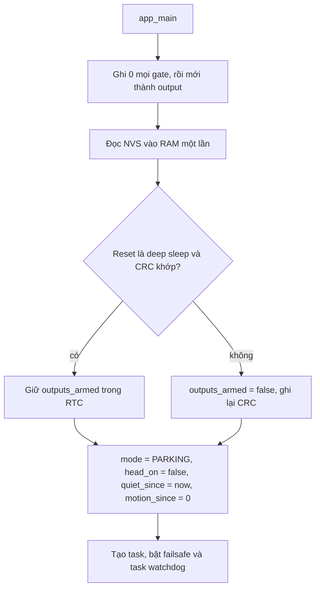

Biến khác lúc vào `PARKING` đầu tiên: `alarm_ready_at = 0`, `fault_latch = false`, `horn_lockout = false`, `aux_latch = false`, `motion_fault = false`. `stable` của mọi công tắc bắt đầu bằng false cho tới khi một mức sống đủ 30 ms. Nhánh tải chưa arm nên công tắc kẹt lúc cắm điện không kêu còi.

Watchdog task: `vehicle` 200 ms, `sensors` 2 s, `gps` 5 s. Mỗi vòng của task đó xoa watchdog, kể cả vòng không có byte UART.

## 8.4 Nhịp 10 ms

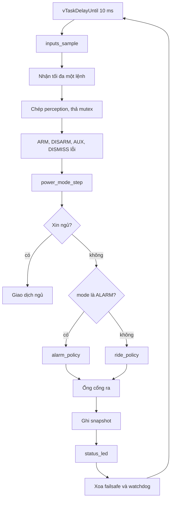

Một nhịp xử lý một lệnh. Lệnh xếp sau chờ nhịp sau, đúng thứ tự đẩy vào hàng. `power_mode_step` trả `mode` mới và cờ xin ngủ. Có cờ thì nhịp đó không gọi chính sách đèn.

Cuối nhịp mới xoa failsafe. Nếu vòng không tới cuối trong 50 ms, timer kéo bảy gate về thấp và tắt duty LEDC, không lấy mutex. Vòng sau còn sống thì ghi lại mức của chính sách. Vòng chết thì watchdog reset; reset này không phải deep sleep nên tải tắt.

## 8.5 Debounce và hazard

Mỗi công tắc giữ `candidate`, `candidate_since_ms`, `stable`. `raw` true khi chân thấp.

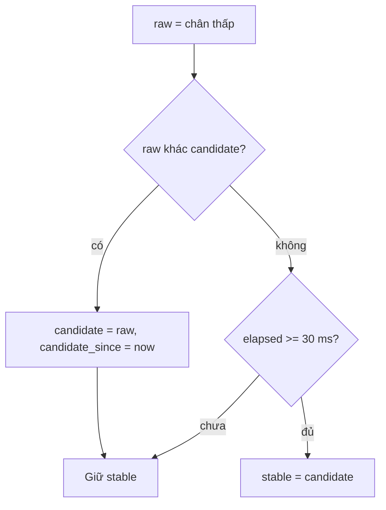

Rung liên tục dưới 30 ms không đổi `stable`. Đúng 30 ms thì nhận. Sau sáu kênh:

`hazard = stable.left && stable.right`.

Công tắc thả là chân cao. Dây hở nhờ pull-up trên PCB nên ra `raw` false, cùng nghĩa với không bấm. Hai phía không cùng thấp thì không có hazard, kể cả khi diode bên kia chưa kịp về cao: phía còn lại phải tự debounce xong mức thấp.

## 8.6 Lệnh

Hàng là queue tĩnh dài 4, tạo lúc init. Callback BLE gọi gửi với timeout 0. Hàng đầy thì bỏ lệnh mới, tăng `cmd_dropped`, giữ lệnh đang chờ. Opcode lạ bỏ trước khi vào hàng. `vehicle` lấy một phần tử mỗi nhịp, timeout 0.

| Lệnh | Khi đang | Việc |
| --- | --- | --- |
| `ARM` | bất kỳ | Bật `outputs_armed`, ghi RTC, xóa `fault_latch` |
| `DISARM` | bất kỳ | Tắt arm, xóa fault, xóa `aux_latch`, xóa khóa còi |
| `AUX_ON` / `AUX_OFF` | bất kỳ | Đổi chốt RAM. Deep sleep xóa chốt vì `app_main` đặt lại false |
| `DISMISS` | `ALARM` | Về `PARKING` và xóa `fault_latch` |
| `DISMISS` | mode khác | Chỉ xóa `fault_latch` |
| `RIDE_START` | `PARKING` | Sang `RIDING` |
| `RIDE_START` | `RIDING` hoặc `ALARM` | Bỏ |
| `RIDE_STOP` | `RIDING` | Sang `PARKING` |
| `RIDE_STOP` | mode khác | Bỏ |

`RIDE_START` trong `ALARM` bị bỏ để một lệnh đi xe không tắt báo động. Tắt báo động bằng `DISMISS` hoặc hết 30 s. Cùng một nhịp nếu có `RIDE_START` hợp lệ thì nhánh đó chạy trước nhánh báo động và trước nhánh ngủ.

Ghi NVS không nằm trên nhịp này. Cờ arm chỉ ghi RAM RTC.

## 8.7 Chuyển mode

Biến nhớ: `mode`, `motion_since_ms`, `quiet_since_ms`, `alarm_since_ms`, `alarm_ready_at`. Mốc 0 nghĩa là chưa chạy. Một nhịp chỉ một lần đổi mode. Vào `PARKING` thì đặt lại mốc theo mẫu hiện tại, sau khi đã xử lý lệnh của mode cũ.

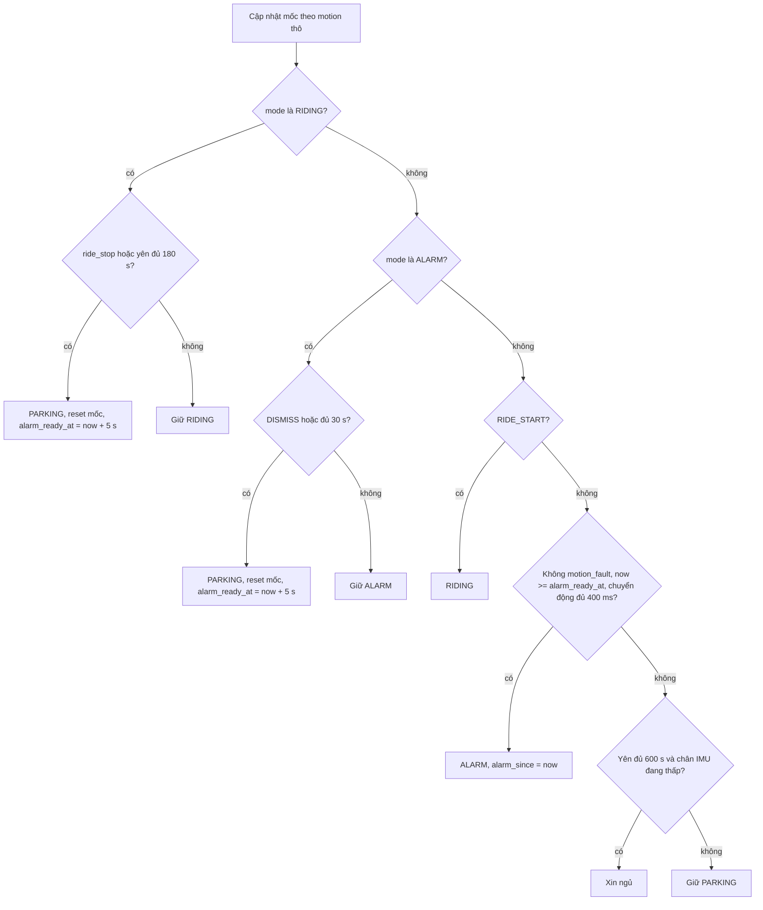

Cập nhật mốc:

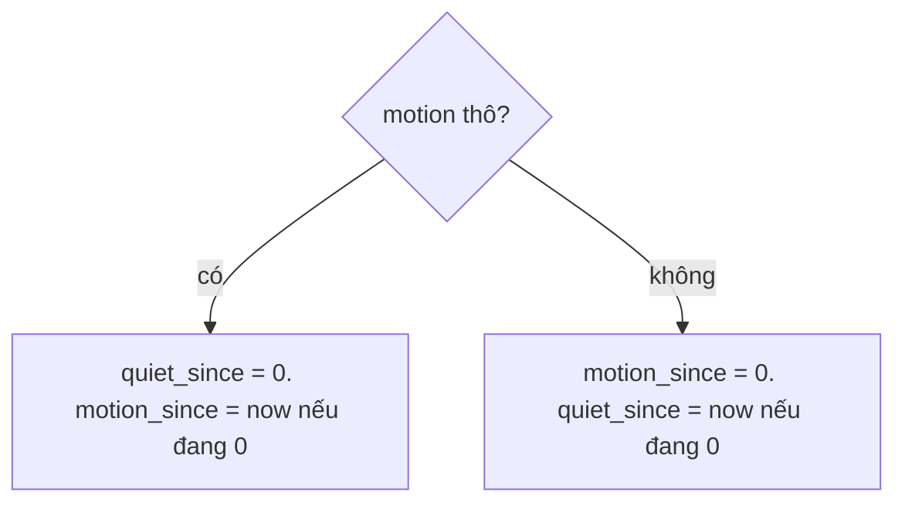

`motion_fault` không làm mốc yên chạy. Nó chỉ chặn nhánh sang `ALARM`. Xe đang bị mang đi vẫn có `motion` thô nên không ngủ, và báo động vẫn lặp sau mỗi lần nghỉ 5 s.

Reset lúc chạm `PARKING`: đang có chuyển động hợp lệ thì `motion_since = now` và `quiet_since = 0`; ngược lại thì `motion_since = 0` và `quiet_since = now`.

`RIDING` không sang `ALARM`. Lần báo động sau chỉ mở khi đã hết 5 s nghỉ và đoạn chuyển động hiện tại đã dài đủ 400 ms. Chuyển động không đứt thì 400 ms nằm trọn trong lúc nghỉ, nên báo động mở đúng lúc hết 5 s. `alarm_ready_at = 0` lúc boot nên cú chuyển động đầu không phải chờ 5 s.

Xin ngủ còn đòi chân `GPIO38` đang thấp. Chân kẹt cao thì ở lại `PARKING`, không tạo vòng thức ngay.

## 8.8 Cờ chuyển động

Task `sensors` đổi xung any-motion thành mức.

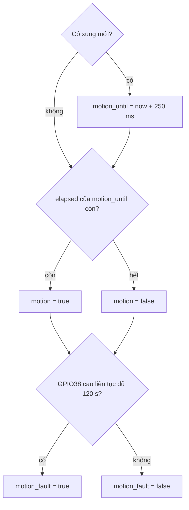

Xung any-motion lên rồi xuống là chuyển động thật. Phần mềm giữ mức `motion` thêm 250 ms sau xung cuối để nhịp 10 ms đọc kịp. Chân kẹt cao 120 s mới là `motion_fault`: chặn báo động, không biến khoảng đó thành “đang yên”, và không xin ngủ vì mục 8.7 còn đòi chân đang thấp. Hết kẹt, chân xuống thấp thì `motion_fault` xóa. Ngưỡng `alarm_mg` nằm trong BMI270, trước khi ra xung.

## 8.9 Đèn pha

`LIGHT_SW` ép duty mà không sửa `head_on`. Lux hợp lệ khi có mẫu và tuổi mẫu nhỏ hơn 1000 ms. Lux từ 100 đến 200, kể cả hai đầu mút, giữ `head_on`. Lux 99 bật. Lux 201 tắt.

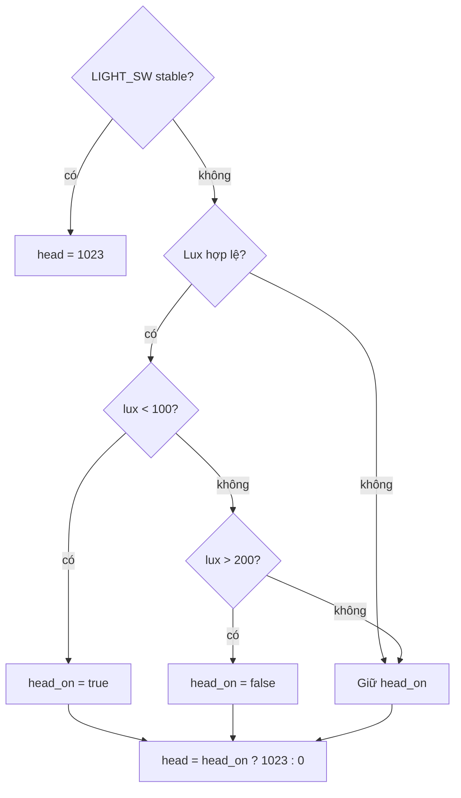

Chưa từng có mẫu lux và không bấm công tắc thì `head_on` vẫn false, đèn pha tắt.

## 8.10 Đèn hậu, phanh, xi-nhan, còi người lái

Các luật này chỉ trong `ride_policy`, tức `PARKING` và `RIDING`.

Đèn hậu: `tail = (mode == RIDING) ? 1023 : 0`.

Phanh: `brake = stable.brake`.

Xi-nhan. `phase_on = (now_ms % 800) < 400`. Cờ logic `left_lit` / `right_lit` đúng suốt thời gian công tắc giữ, cả trong nửa kỳ duty bằng 0. Cổng ra dùng cờ logic để tính dòng, không dùng duty tức thời.

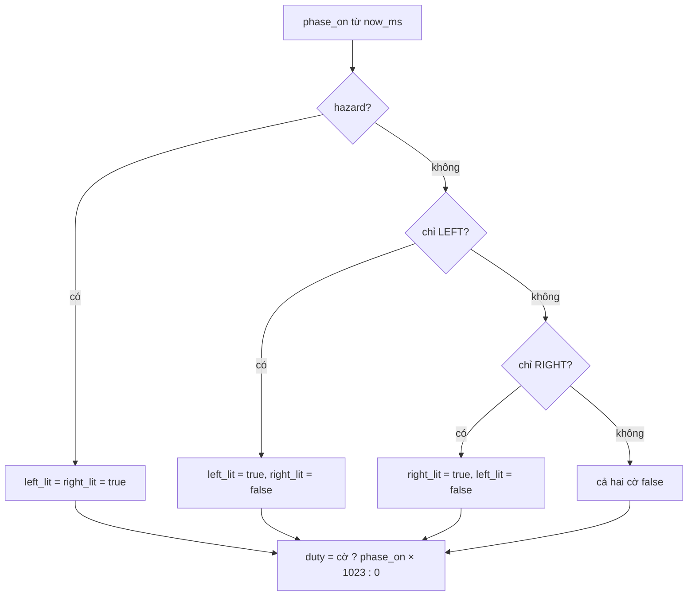

Còi người lái, trước ống cổng ra:

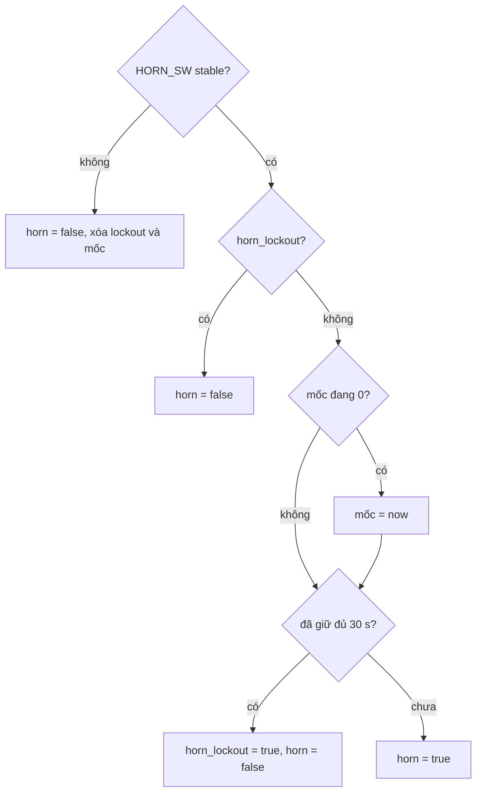

Bộ đếm 30 s chạy từ lúc `stable` thành true, kể cả khi chưa arm. Công tắc kẹt lúc khởi động sẽ khóa trước khi có lệnh arm. Thả đến mức stable cao thì xóa khóa, lần bấm sau kêu lại. Còi báo động không đi qua luật này.

`ride_policy` ghép đèn pha, hậu, phanh, xi-nhan và còi người lái. `horn_from_alarm = false`.

## 8.11 Chu kỳ báo động

`elapsed = (now_ms - alarm_since_ms) % 1000`. Công tắc còi và phanh không sửa chu kỳ này.

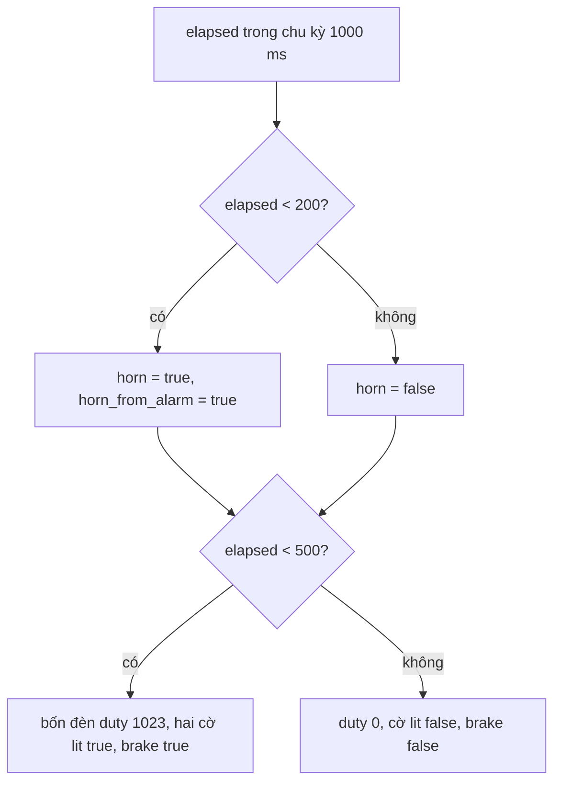

Hết 30 s thì mục 8.7 về `PARKING` ở nhịp kế. `left_lit` và `right_lit` trong nửa sáng để cổng ra biết báo động đang kéo cả cụm đèn, dù duty nhấp theo chu kỳ riêng chứ không theo 1.25 Hz.

## 8.12 Ống cổng ra

Các bước chạy đúng thứ tự sau. Bước sau thấy kết quả bước trước.

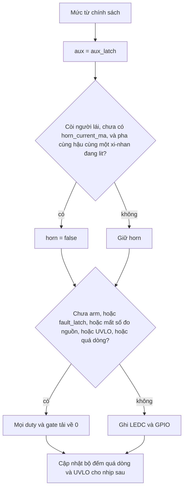

Còi có `horn_from_alarm` không bị luật `horn_current_ma` xóa. Luật đó chặn còi người lái giữ liên tục khi chưa đo dòng. Còi báo động đã bị giới hạn 200 ms mỗi giây, và vẫn chịu cắt quá dòng cùng cắt mất số đo.

`left_lit` đúng cả khi duty xi-nhan đang ở nửa tắt, nên còi người lái không bị bật rồi tắt theo 1.25 Hz.

Chưa arm thì chính sách vẫn chạy để snapshot còn thấy ý định đèn. GPIO tải vẫn thấp.

## 8.13 Áp và dòng

Số đo nguồn hợp lệ khi INA228 đọc thành công và tuổi mẫu nhỏ hơn 200 ms. Không hợp lệ thì nhịp đó cấm tải. Dòng âm do lệch không thì bộ giới hạn coi là 0; snapshot vẫn gửi giá trị thô.

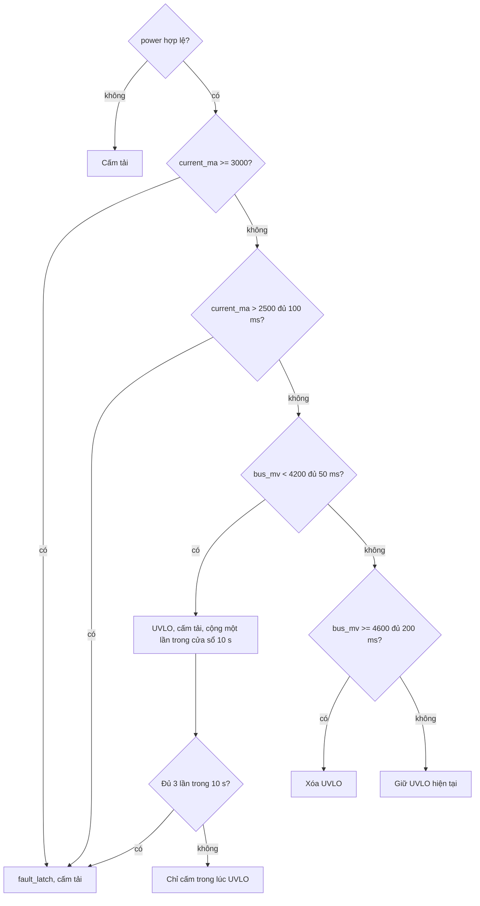

`ARM` và `DISMISS` xóa `fault_latch`. UVLO tự xóa khi áp hồi, trừ khi đã thành `fault_latch`. Ba lần sụt áp trong 10 s thành khóa, tránh vòng bật tải rồi sụt rồi bật lại.

## 8.14 LED trạng thái

Một nhịp chỉ một kiểu, theo thứ tự:

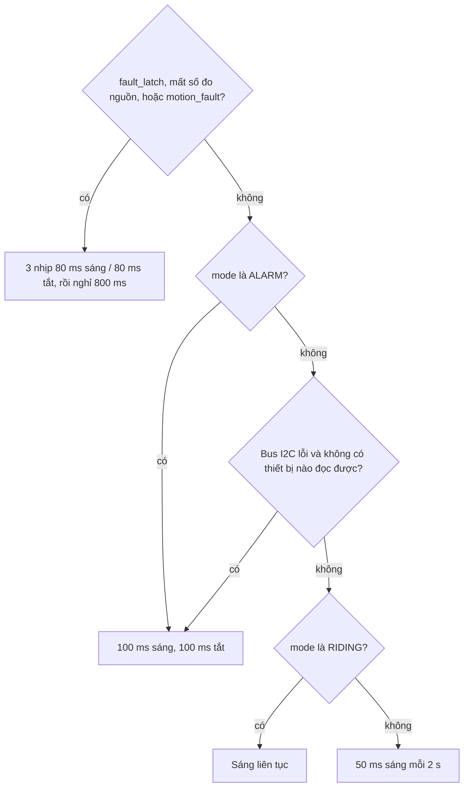

Mất riêng BH1750 không dùng kiểu này. Đèn pha giữ trạng thái theo mục 8.9, LED trạng thái vẫn theo mode.

## 8.15 Giao dịch ngủ

Chỉ bắt đầu khi mục 8.7 xin ngủ. Vòng chờ cắt 10 ms một lần, mỗi lát xoa failsafe và watchdog, không giữ mutex snapshot.

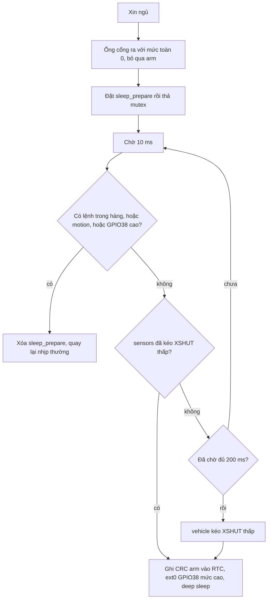

Hủy ngủ thì nhịp sau chạy chính sách bình thường. Task `sensors` khi thấy `sleep_prepare` kéo `XSHUT` thấp, giữ INT1 any-motion, rồi xóa cờ. Nếu chân GPIO38 đang cao, mục 8.7 đã không xin ngủ.

Thức dậy vào `app_main`. CRC đúng thì giữ arm. `aux_latch` tắt. Mode đầu là `PARKING`.

## 8.16 Tri giác

Một task `sensors`, chu kỳ 50 ms. INA228, BMI270 và VL53L1X mỗi vòng. BH1750 mỗi 500 ms. Lịch này giữ bus 100 kHz rảnh cho đúng hạn 200 ms của số đo nguồn.

Lỗi giao dịch I2C: phát xung SCL chín lần, tạo STOP, thử lại một lần. Phục hồi bus tối đa một lần mỗi giây. Vẫn lỗi thì mẫu thiết bị đó hết hạn theo mục dưới, không reset cả chip.

| Mẫu | Hết hạn | Việc khi hết hạn |
| --- | --- | --- |
| Nguồn | 200 ms | Cấm tải, LED kiểu lỗi nguồn |
| Lux | 1000 ms | Giữ `head_on` |
| Khoảng cách | 500 ms | `obstacle = false`, `range_mm = 0xFFFF` |
| Chuyển động | theo mục 8.8 | Hết hold thì `motion` false |

LiDAR:

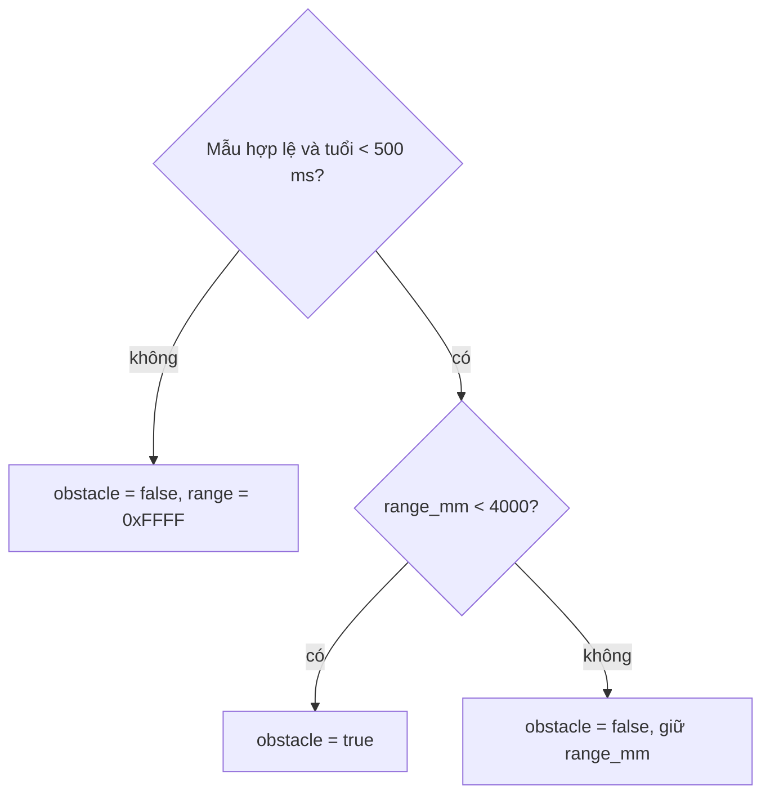

`range_mm` bằng 0 và mẫu hợp lệ là vật cản. Bằng 4000 thì không. `ride_policy` không đọc cờ này.

GPS, mỗi dòng tối đa 128 byte:

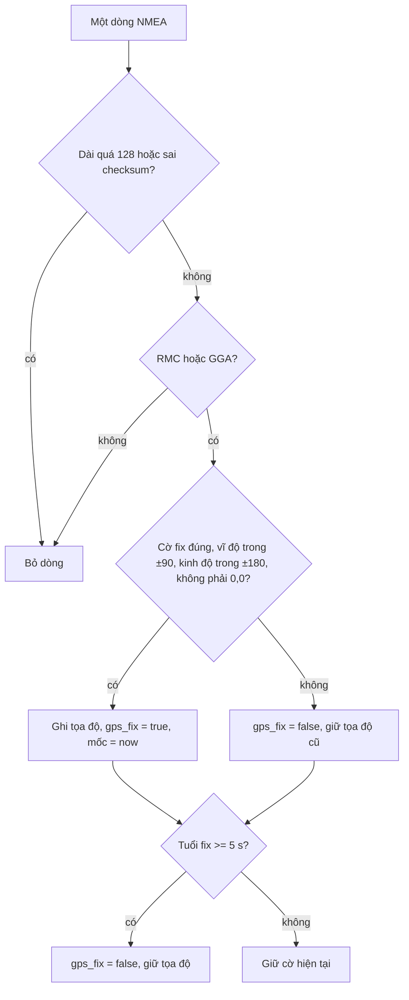

## 8.17 Bảng trường hợp

Mỗi hàng là một tình huống đã có nhánh. “Cấm tải” nghĩa là bảy gate thấp dù chính sách đang muốn bật.

| Tình huống | Kết quả |
| --- | --- |
| Cấp nguồn, công tắc nhả | `PARKING`, arm tắt, gate thấp, `head_on` false |
| Deep sleep, CRC đúng | Giữ arm, mode `PARKING`, AUX tắt |
| Reset watchdog hoặc cắm USB | Arm tắt dù RAM RTC còn số cũ |
| Công tắc rung dưới 30 ms | `stable` không đổi |
| Đúng 30 ms cùng mức | `stable` nhận mức đó |
| Chỉ trái thấp | Xi-nhan trái, không hazard |
| Trái và phải cùng thấp | Hazard cùng pha |
| Đổi trái sang phải giữa kỳ | Pha không reset |
| Nửa kỳ xi-nhan đang tắt, chưa biết dòng còi, pha và hậu đang sáng | Còi người lái vẫn bị cấm, vì `left_lit` còn true |
| Chỉ đèn pha, chưa biết dòng còi | Còi người lái được phép |
| Giữ còi đủ 30 s | Tắt đến khi thả hẳn |
| Còi kẹt từ lúc boot | Khóa trước khi arm, arm sau vẫn im đến khi thả |
| Lux 99 / 100 / 200 / 201 | Bật / giữ / giữ / tắt |
| Mất lux hơn 1 s | Giữ `head_on`. Công tắc đèn vẫn ép bật |
| `PARKING` | Hậu tắt. Phanh, xi-nhan, còi theo công tắc |
| `RIDING`, có chuyển động | Không sang `ALARM` |
| `RIDING`, yên 180 s | `PARKING` |
| `RIDE_START` trong `ALARM` | Bỏ lệnh, giữ `ALARM` |
| `DISMISS` trong `ALARM` | `PARKING`, xóa khóa lỗi |
| `DISMISS` khi không báo động | Chỉ xóa khóa lỗi |
| Hết báo động mà vẫn chuyển động | Nghỉ 5 s rồi mới được báo động tiếp |
| GPIO38 cao liên tục 120 s | `motion_fault`, không báo động thêm, không ngủ. Chuyển động thật dạng xung vẫn báo động lặp sau mỗi 5 s |
| Xin ngủ rồi có chuyển động hoặc lệnh | Hủy ngủ, nhịp sau chạy chính sách |
| Hết 200 ms chưa thấy xác nhận `XSHUT` | Tự kéo `XSHUT`, rồi ngủ |
| GPIO38 đang cao | Không xin ngủ |
| Chưa arm | Chính sách vẫn tính, GPIO thấp |
| Mất INA228 quá 200 ms | Cấm tải |
| Dòng trên 2500 mA đủ 100 ms, hoặc từ 3000 mA | `fault_latch`, cấm tải |
| Áp dưới 4200 mV đủ 50 ms | Cấm tải đến khi áp từ 4600 mV đủ 200 ms |
| Ba lần sụt áp trong 10 s | `fault_latch` |
| `ARM` khi đang khóa lỗi | Xóa khóa và bật arm |
| LiDAR 3999 mm / 4000 mm / mất mẫu | Cờ vật cản bật / tắt / tắt. Phanh không đổi |
| GPS sai checksum hoặc 0,0 | Giữ tọa độ cũ, hạ fix nếu câu này không hợp lệ |
| Hàng lệnh đầy | Bỏ lệnh mới, giữ lệnh cũ |
| `ARM` rồi `RIDE_START` đang xếp hàng | Nhịp này arm, nhịp sau mới `RIDING` |
| Task `vehicle` không xoa failsafe trong 50 ms | Gate thấp đến khi vòng sống lại hoặc watchdog reset |
| Vật cản trong 4 m | Chỉ có trong snapshot |

## 8.18 Ngân sách

Vòng `vehicle` không chờ bus. Phần việc của nó là đọc GPIO, vài phép so sánh và ghi duty. Mục tiêu dưới 2 ms, trần failsafe 50 ms.

Bus I2C chỉ có một chủ. Ưu tiên mẫu nguồn mỗi 50 ms vì mất mẫu là cấm tải. Lux chậm hơn vì luật đèn đã có vùng giữ.
