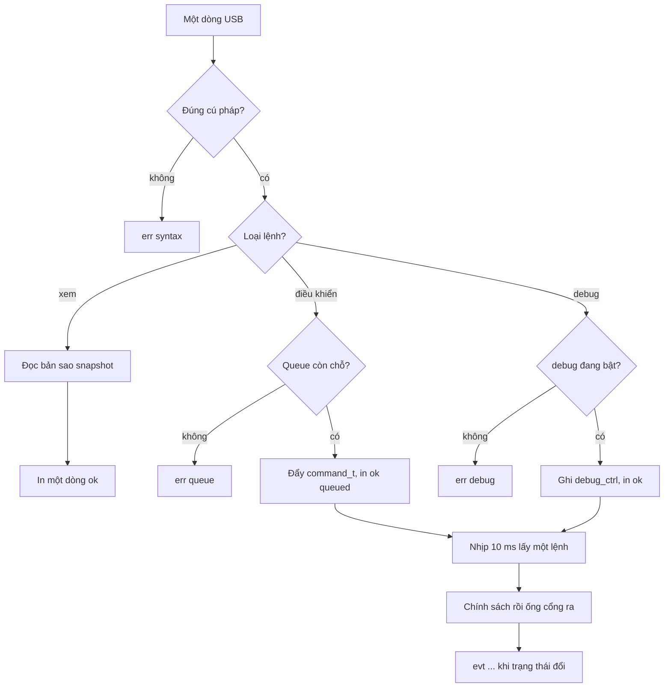

# 9. Lệnh test và debug thủ công

Console này là đường điều khiển bằng tay trên USB Serial/JTAG, cùng cổng nạp firmware. Mỗi lệnh kiểm tra một nhánh đã khóa ở [08-control-algorithms.md](08-control-algorithms.md). Lệnh không mở thêm hành vi xe. Lệnh chỉ đưa đầu vào mà nhịp 10 ms vốn đã có, hoặc in trạng thái nhịp đó đang giữ.

## 9.1 Đường đi của một dòng

Task `console` đọc stdin, phân tích một dòng, rồi trả lời. Task này không gọi GPIO, LEDC, I2C, hay deep sleep. Mức tải chỉ đổi khi nhịp `vehicle` xử lý lệnh hoặc đọc khối debug.

`arm`, `disarm`, `ride`, `dismiss`, `aux` đi vào cùng queue dài 4 với BLE. Một nhịp lấy một lệnh. Hàng đầy thì lệnh mới bị bỏ và console in `err queue` ngay, không chờ.

`hold` và `inject` ghi struct `debug_ctrl` trong RAM. Nhịp sau chép struct đó cùng lúc với perception. Tắt `debug` hoặc reset thì struct về rỗng. Reset không phải deep sleep cũng tắt arm, như mục 8.3.

## 9.2 Cú pháp và câu trả lời

Một dòng tối đa 80 byte, kết thúc bằng LF. Token cách nhau bởi một dấu cách, chữ thường, số thập phân. Không có dấu phẩy, không có chuỗi trong ngoặc.

Mỗi lệnh nhận đúng một dòng trả lời ngay:

| Dòng | Nghĩa |
| --- | --- |
| `ok` | Đã ghi nhận |
| `ok queued` | Đã vào queue, chưa phải đã đổi mode |
| `ok k=v k=v` | Kết quả đọc |
| `err syntax` | Thiếu token hoặc thừa token |
| `err range` | Số ngoài khoảng cho phép |
| `err debug` | Lệnh cần phiên debug mà phiên đang tắt |
| `err queue` | Queue đầy, lệnh không vào |
| `err nvs` | Ghi NVS thất bại |

Khi nhịp 10 ms thực sự đổi trạng thái, console in thêm một dòng `evt`, không thay dòng `ok`:

| evt | Khi |
| --- | --- |
| `evt arm=1` / `evt arm=0` | Arm đổi |
| `evt mode=parking` / `riding` / `alarm` | Mode đổi |
| `evt reject=<lệnh> <lý do>` | Lệnh bị mục 8.6 bỏ. Lý do là `mode` |
| `evt fault=1` / `evt fault=0` | `fault_latch` đổi |
| `evt inhibit=<mã>` | Lý do cấm tải đổi |
| `evt sleep=start` / `abort` / `enter` | Giao dịch ngủ |
| `evt hold=off` | Hết hạn giữ kênh |

Mã `inhibit`: `none`, `disarmed`, `power`, `uvlo`, `oc`, `fault`.

`firmware/tools/bringup_log.py` gửi đúng các dòng này và chỉ cần hiểu `ok`, `err`, `evt`.

## 9.3 Lệnh xem

Các lệnh này không cần `debug` và không vào queue.

| Lệnh | In ra | Dùng khi |
| --- | --- | --- |
| `help` | Danh sách lệnh, một lệnh một dòng `ok cmd=...` | Quên cú pháp |
| `status` | mode, armed, fault, uvlo, inhibit, debug, v, i, lux, range, motion | Nhìn một nhịp |
| `inputs` | raw và stable của sáu công tắc, kèm hazard | Soát debounce 30 ms |
| `sense` | bốn địa chỉ I2C còn sống, tuổi mẫu lux/range/power, gps_fix | Biết mẫu nào hết hạn |
| `power` | bus_mv, current_ma, power_dw, energy_mwh, power_valid | Đối chiếu INA228 |
| `gates` | duty và mức boolean muốn, rồi mức đã ghi ra chân | Thấy chốt arm và luật còi |
| `faults` | fault_latch, uvlo_count, cmd_dropped, failsafe_count, motion_fault, horn_lockout | Đếm lỗi |
| `config` | Mọi hằng RAM mục 8.2 | Xác nhận số đang dùng |
| `snapshot` | 32 byte BLE, hex liền | So với notify điện thoại |
| `watch <ms>` | Lặp `status` mỗi ms | Theo dõi liên tục |
| `watch off` | Dừng lặp | |

`watch` nhận 100 đến 5000. Task `console` tự in, nhịp 10 ms không gọi `printf`. `inputs` in cả `raw` và `stable` để thấy rung dưới 30 ms không đổi `stable`.

`gates` in hai lớp: `want_*` trước ống cổng ra và `out_*` sau ống. Bring-up chưa arm thì `want_head` có thể khác 0 trong khi `out_head` bằng 0.

## 9.4 Lệnh điều khiển

Cùng nghĩa với opcode BLE. Không cần phiên debug.

| Lệnh | Opcode | Việc của nhịp 10 ms |
| --- | --- | --- |
| `arm` | `0x03` | Bật arm, xóa `fault_latch`, ghi RTC |
| `disarm` | `0x04` | Tắt arm, xóa fault, xóa AUX, xóa khóa còi |
| `ride start` | `0x01` | `PARKING` sang `RIDING`. Mode khác thì `evt reject=ride_start mode` |
| `ride stop` | `0x02` | `RIDING` sang `PARKING`. Mode khác thì reject |
| `dismiss` | `0x05` | Trong `ALARM` thì về `PARKING`. Luôn xóa `fault_latch` |
| `aux on` | `0x06` | Chốt AUX |
| `aux off` | `0x07` | Nhả AUX |

`ok queued` chỉ nghĩa là hàng đã nhận. Mode mới nằm ở dòng `evt` của nhịp sau. Gõ `arm` rồi `ride start` trên hai dòng thì đúng luật một lệnh mỗi nhịp: arm trước, sang `RIDING` ở nhịp kế.

## 9.5 Phiên debug

`debug on` mở phiên trong RAM. `debug off` và mọi reset đều đóng phiên, xóa `hold` và `inject`. Phiên không ghi NVS, không sống qua deep sleep.

Lệnh mục 9.6 và 9.7 khi phiên tắt trả `err debug` và không ghi gì.

`debug` không in thêm. `status` có trường `debug=0|1`.

## 9.6 Giữ một kênh tải

Dùng khi đo dòng từng tải trên nguồn J1, đúng bước gắn từng tải một của bring-up.

| Lệnh | Tác dụng |
| --- | --- |
| `hold head on` | Ép duty pha = 1023 |
| `hold head <0..1023>` | Ép đúng duty |
| `hold head off` | Ép duty pha = 0 |
| `hold tail on\|off\|<duty>` | Đèn hậu |
| `hold left on` | `left_lit` true, duty vẫn theo pha 800 ms |
| `hold left off` | Duty trái = 0 và `left_lit` false |
| `hold left <0..1023>` | Ép đúng duty, không nhấp. `left_lit` true khi duty khác 0 |
| `hold right ...` | Cùng luật với trái |
| `hold brake on\|off` | GPIO phanh. Có duty thì `err syntax` |
| `hold horn on\|off` | GPIO còi người lái |
| `hold aux on\|off` | GPIO AUX |
| `hold off` | Xóa mọi ép kênh |

`hold horn on 500` thừa token, trả `err syntax`, không ép một nửa.

Kênh không bị `hold` vẫn do chính sách tính. Sau khi trộn, ống cổng ra chạy nguyên: chưa arm thì mọi chân vẫn thấp, mất số đo nguồn thì thấp, UVLO và quá dòng vẫn khóa, còi người lái vẫn chịu luật 30 s và luật chưa biết dòng còi. `hold` không tắt các luật đó.

Mỗi kênh đang giữ hết hạn sau 30 s rồi tự nhả, in `evt hold=off`. Muốn giữ lâu hơn thì gõ lại lệnh. Còi vì vậy không kêu mãi nếu cáp USB tuột giữa chừng.

`hold left on` và `hold right on` đi theo pha xi-nhan, nên nửa kỳ tắt vẫn có `left_lit` true. Số duty cố định chỉ dùng khi đo dòng, và lúc đó kênh không nhấp. Luật còi đọc cờ `lit`, không đọc duty tức thời.

## 9.7 Bơm đầu vào

Bơm thay giá trị mà chính sách và mode đọc. Không thay số đo nguồn. Áp và dòng trong ống cổng ra luôn là số của INA228.

| Lệnh | Khoảng | Thay cho |
| --- | --- | --- |
| `inject lux <0..65535>` | lux | BH1750 trong luật đèn pha |
| `inject lux off` | | Trả lux về cảm biến |
| `inject motion on` | | `motion` thô |
| `inject motion off` | | `motion` thô false |
| `inject clear motion` | | Trả chuyển động về IMU |
| `inject range <0..65534>` | mm | Khoảng cách LiDAR |
| `inject range off` | | Trả về cảm biến |
| `inject pin low` | | Chỉ vị từ “chân IMU thấp” trong luật xin ngủ |
| `inject pin high` | | Cấm xin ngủ theo luật phần mềm |
| `inject pin off` | | Trả về GPIO38 thật |
| `inject off` | | Xóa mọi bơm |

`inject range 65535` bị `err range` vì `0xFFFF` là mã không có mẫu. `inject range 0` hợp lệ và phải làm `obstacle` true. `inject range 4000` phải làm `obstacle` false.

`inject pin` không đụng `esp_sleep_enable_ext0_wakeup`. Chân thật vẫn là nguồn thức. Bơm `pin low` chỉ để đi hết giao dịch ngủ trên bàn khi chân đang cao. Nếu chân thật vẫn cao, chip sẽ thức lại ngay; `status` sau boot cho thấy reset deep sleep và arm còn hay không.

`sense` in cả giá trị cảm biến và giá trị sau bơm, với cờ `inj=lux` khi bơm còn hiệu lực. Người test không tưởng nhầm lux bơm là lux đo được.

## 9.8 Sửa hằng trong RAM

`config set <tên> <số>` sửa bản RAM. Nhịp sau dùng số mới. `config save <tên>` chỉ có với hai tên được ghi NVS, và ghi đó chạy trên task `console`.

| Tên | Khoảng | Cần debug | Được save |
| --- | --- | --- | --- |
| `horn_current_ma` | 0..5000, 0 là chưa biết | không | có |
| `shunt_cal` | 1..65535 | không | có |
| `stop_idle_s` | 5..3600 | có | không |
| `sleep_after_s` | 5..3600 | có | không |
| `alarm_s` | 1..120 | có | không |
| `alarm_gap_s` | 0..60 | có | không |
| `alarm_motion_ms` | 50..5000 | có | không |
| `debounce_ms` | 0..500 | có | không |
| `oc_ma` | 100..2500 | có | không |
| `uvlo_mv` | 3000..4500 | có | không |

`oc_ma` không đặt được trên 2500. `failsafe_ms` không có trong bảng. Reset đưa các tên không save về mặc định mục 8.2. `horn_current_ma` và `shunt_cal` đã save thì nạp lại từ NVS lúc boot.

`config set oc_ma 3000` trả `err range` và giữ số cũ.

## 9.9 Ngủ và quét bus

| Lệnh | Đường | Việc |
| --- | --- | --- |
| `sleep` | queue, cần debug | Nhịp sau xin ngủ nếu đang `PARKING`, đang yên, và vị từ chân IMU cho phép. Thiếu điều kiện thì `evt sleep=abort` kèm lý do `mode`, `motion` hoặc `pin` |
| `i2c` | cờ cho task `sensors` | Quét lại bus, in `ok addr=40,23,29,68` hoặc địa chỉ thiếu |

`i2c` không quét trên task console. Task `sensors` quét ở vòng của nó rồi console in kết quả. Quét trùng với giao dịch đang chạy thì vòng đó hoãn quét một nhịp, không chen giữa một lần đọc INA228.

## 9.10 Kịch bản gõ tay

Mỗi kịch bản giả định dòng `ok` đã về trước khi gõ dòng tiếp. Nguồn tải là J1 khi có lệnh `hold` hoặc `arm` mà công tắc đang bấm. Trên chỉ USB, arm vẫn bật được cờ nhưng ống cổng ra cấm tải nếu dòng tổng kéo sụt áp hoặc chạm ngưỡng quá dòng.

**Gate lúc boot.** `status` rồi `gates`. Kỳ vọng `armed=0`, `inhibit=disarmed`, mọi `out_*=0`.

**Debounce.** `watch 100`, bấm rồi thả từng công tắc. `raw` đổi ngay, `stable` đổi khi đủ `debounce_ms`. Rung nhanh hơn 30 ms thì `stable` đứng yên. `watch off`.

**Hazard.** Giữ trái và phải. `inputs` có `hazard=1`. Chỉ giữ trái thì `hazard=0` và `stable_right=0`.

**Arm không sống qua USB reset.** `arm`, thấy `evt arm=1`, nhấn reset. `status` có `armed=0`.

**Một tải.** Nguồn J1. `arm`, `debug on`, `hold head on`, đo dòng, `hold off`. Lặp `tail`, `left`, `right`, `brake`, `horn`, `aux`. Giữa hai kênh là `hold off`.

**Đèn pha.** `debug on`, `inject lux 99` thì `gates` có `want_head=1023` sau khi arm. `inject lux 100` giữ nguyên. `inject lux 201` thì `want_head=0`. `inject lux off` trả về cảm biến. Bấm `LIGHT_SW` trong lúc `inject lux 201` thì `want_head=1023`, thả thì về 0.

**Xi-nhan và luật còi.** `config set horn_current_ma 0` nếu đang khác 0. `arm`, `debug on`, `hold head on`, `hold tail on`, `hold left on`, `hold horn on`. Trái vẫn nhấp. `out_horn=0` cả ở nửa kỳ duty trái bằng 0. `hold left off` thì `out_horn` được phép lên 1. `config set horn_current_ma 800` rồi `config save horn_current_ma` khi đã đo dòng còi thật, luật cấm này hết hiệu lực.

**Còi 30 s.** `hold horn on`, chờ `evt hold=off`. Thả công tắc vật lý nếu đang kẹt, rồi `hold horn on` lại được.

**Quá dòng và khóa.** `debug on`, `config set oc_ma 100`, `arm`, `hold head on` với một tải nhỏ hơn cầu chì nhưng hơn 100 mA. Kỳ vọng `evt fault=1`, `out_*=0`. `hold head on` lần nữa không sáng cho đến `dismiss` hoặc `arm`. `config` sau reset hết `oc_ma` đã hạ.

**Mất số đo nguồn.** Rút tạm module hoặc để mẫu quá 200 ms trên bàn có kẹp. `inhibit=power`, mọi `out_*=0` dù `armed=1`.

**Mode.** `config set stop_idle_s 5` trong phiên debug. `ride start` chỉ từ `PARKING`. `inject motion on` rồi `ride start`: ở `RIDING` và không sang `ALARM`. `inject motion off`, sau 5 s có `evt mode=parking`. `ride start` lúc `mode=alarm` ra `evt reject=ride_start mode`.

**Báo động lặp.** `config set alarm_s 2`, `config set alarm_gap_s 5`, `config set alarm_motion_ms 400`. Về `PARKING`, `inject motion on`. Vào `ALARM` khoảng 400 ms, hết 2 s thì về `PARKING`, khoảng 5 s sau vào `ALARM` lại nếu bơm còn `on`.

**LiDAR không phanh.** `inject range 3999`. `status` có cờ vật cản, `out_brake` không đổi theo range. `inject range 4000` thì cờ tắt.

**Ngủ.** `config set sleep_after_s 5`, `inject motion off`, `inject pin low`, `sleep`. Có `evt sleep=enter` khi đủ yên. `inject motion on` trong lúc chờ thì `evt sleep=abort`.

**Hàng lệnh.** Không có lệnh riêng để làm đầy hàng. Bốn lệnh BLE viết dồn trong một nhịp 10 ms, lệnh thứ năm trên console trả `err queue`, bốn lệnh cũ vẫn chạy đúng thứ tự.

## 9.11 Việc console không làm

- Không ghi gate từ task `console`.
- Không bơm áp hoặc dòng để vượt ống cổng ra.
- Không đặt `failsafe_ms`, không tắt watchdog.
- Không ghi NVS ngoài `horn_current_ma` và `shunt_cal`.
- Không thêm opcode BLE. Điện thoại vẫn chỉ có bảy lệnh mục 6.10.
